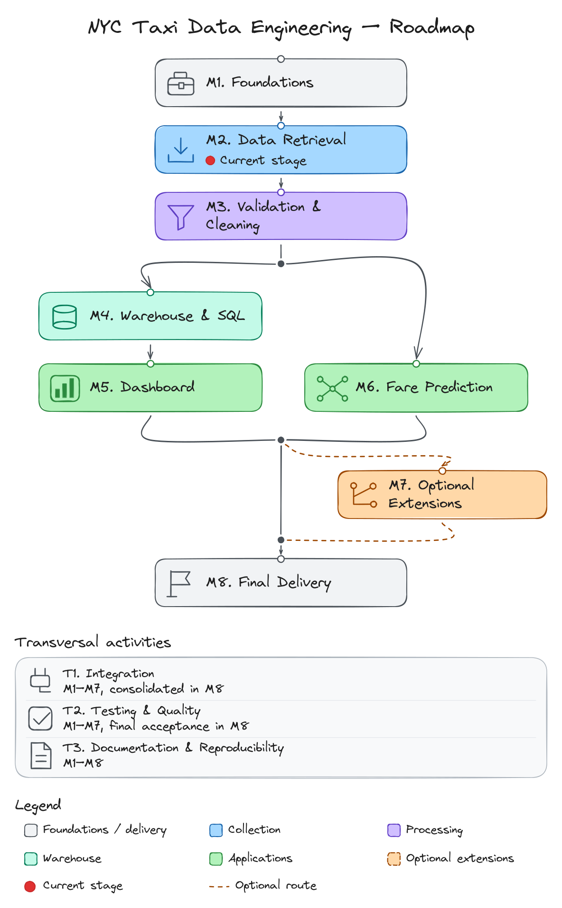

# NYC Taxi Data Engineering

A CY Tech Big Data coursework project using New York City taxi trip records.
The project covers data retrieval, ingestion and validation, SQL analytics,
a dashboard, and a fare prediction service.

## Current Status

The repository contains exercise scaffolding, a pinned Scala toolchain with
local Spark smoke tests, and Docker Compose configuration for RustFS and a Spark
cluster. Application code and the end-to-end pipeline are not implemented yet.
Independent UV projects provide pinned Python development tools and a verified
Marimo smoke notebook. M1.1 development toolchain checks are complete.

## Project Structure


See the [assignment specification](docs/instructions/instructions.pdf) and
[course instructions](docs/instructions/README.md) for requirements and submission details.

## Architecture

[](docs/architecture.md)

See the [architecture document](docs/architecture.md) for component responsibilities,
interfaces, configuration, and design decisions.

## Data Source

The base dataset is the [NYC Taxi and Limousine Commission (TLC) Trip Record Data](https://www.nyc.gov/site/tlc/about/tlc-trip-record-data.page).
TLC publishes monthly Parquet files and provides data dictionaries and taxi zone
lookup tables on that page. The project will use yellow taxi trip records for
**May, June, and July 2026**.

## Setup

Both Scala modules use **JDK 21 LTS**, **sbt 2.0.9**, **Scala 2.13.18**,
and **Apache Spark 4.2.0**. Follow the [Scala toolchain setup](docs/scala-toolchain.md)
to select `JAVA_HOME`, install the sbt runner, and verify the actual runtime.

Build and test each module independently from the repository root:

```bash
(cd exo1_data_retrieval && sbt --batch 'compile; testFull; shutdown')
(cd exo2_data_ingestion && sbt --batch 'compile; testFull; shutdown')
```

Each module uses ScalaTest **3.2.19** to start Spark with `local[2]`, count ten
generated rows, and stop Spark. These checks require no Docker services or taxi
data. `testFull` executes all tests even after a previous successful run.

For infrastructure work, install Docker with Docker Compose and run from the
repository root:

```bash
docker compose up -d
```

The configuration defines RustFS, one Spark master, and two Spark workers.
The RustFS console is at <http://localhost:9001> and the Spark master UI is at
<http://localhost:8080>. RustFS uses `rustfsadmin` for both the development access
key and secret key. Its S3 API is exposed on port `9000`.

Python components in exercises 4 and 5 use **CPython 3.14.7** managed by
**UV 0.12.17**. Each project owns its environment and committed lockfile.
Follow the [Python toolchain setup](docs/python-toolchain.md) to install the
tools, verify the runtime, and open the dashboard's **Marimo** smoke notebook.

Run inside either Python project:

```bash
uv python install 3.14.7
uv sync --locked
uv run --locked pytest
uv run --locked flake8 .
```

These checks require no Docker services or taxi data. Application dependencies
will be added with the dashboard and prediction features.

Stop the infrastructure while retaining the RustFS data volume:

```bash
docker compose down
```

## Roadmap

[](docs/roadmap.md)

See the [detailed roadmap](docs/roadmap.md) for the task Gantt, prerequisites, and expected outputs.

## Collaborators

- [Maxime CRAYSSAC](https://github.com/mcrayssac)
- [PAUL PITIOT](https://github.com/Paul-Pitiot-Cytech-Grp7-Mi)

## License

Project-authored code and documentation are licensed under the
[Apache License 2.0](LICENSE).

Copyright 2026 Maxime CRAYSSAC and PAUL PITIOT.

External TLC datasets and supplied course materials retain their respective
terms and are not covered by this project license.
